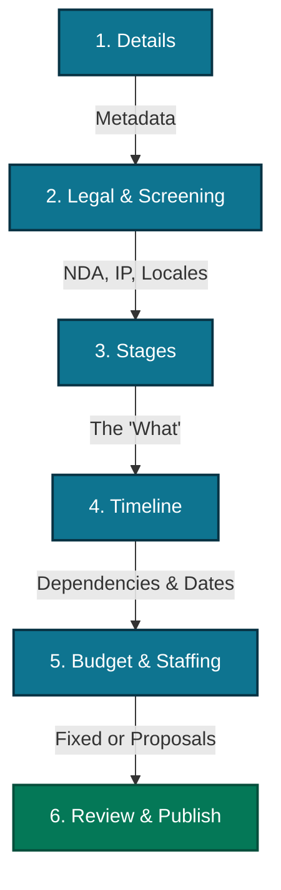

# Project Creation Engine & Stage Architecture

This document defines the structural flow for project creation, the strict behavior of stage
archetypes, and the escrow/refund policies governing them. It serves as the architectural source of
truth for the `projects` and `finance` schemas.

## 1. The 6-Step Project Creation Flow

To prevent cognitive overload and align with the "Modular Project" philosophy, project creation is
decoupled into six distinct phases. This ensures clients define the "What" before negotiating the
"When" and "How Much".



- Step 1: Details: High-level project metadata including Title, Industry Category, and Visibility.

- Step 2: Legal & Screening: Defines global ip_ownership_mode, nda_required, and arrays for
  screening_questions, location_restriction, and language_requirement.

- Step 3: Stages (The "What"): Defines the atomic units of work. Clients input the Stage Title,
  stage_type, and Description. No budgets or timeline dependencies are mapped here.

- Step 4: Timeline (The "When"): A visual Gantt-style interface where clients sequence stages using
  start_trigger_type and start_dependency_stage_id.

- Step 5: Budget & Staffing (The "How Much"): Clients assign fixed budgets via budget_amount_cents
  or toggle require_proposals to solicit bids from the marketplace.

- Step 6: Review & Publish: The draft is finalized and published to the active marketplace.

---

## 2. Stage Archetypes & Escrow Policies

Every stage is categorized by the CREATE framework, dictating its specific "Proof of Work" and
payout triggers.

### A. File-Based Stages

Used for transactional delivery of digital assets (CREATE Category: Create, Run).

Proof of Work: A final submission is uploaded and the client clicks "Approve".

Escrow & "Fair Exit" Policy: Funds are locked in escrow upon hire. If the stage is cancelled early,
a time-based split applies:

```
stateDiagram-v2 [*] --> EscrowFunded: Client Approves Hire EscrowFunded --> ActiveWorkspace

state ActiveWorkspace {
    [*] --> Under25Percent
    Under25Percent --> Between25And75: Time Elapses
    Between25And75 --> Over75Percent: Time Elapses
}

ActiveWorkspace --> Cancelled

state Cancelled {
    direction LR
    c1: Client gets 100% Refund (Talent 0%)
    c2: 50/50 Split (Shared Accountability)
    c3: Talent gets 100% Payout (Substantially Complete)
}

Under25Percent --> c1: Cancel Triggered
Between25And75 --> c2: Cancel Triggered
Over75Percent --> c3: Cancel Triggered

ActiveWorkspace --> Submitted: Talent Uploads Work
Submitted --> Approved: Client Accepts
Approved --> [*]: Payout Released to Talent
```

Configuration: Includes file_revisions_allowed, file_duration_mode (fixed vs relative), and
file_due_date.

### B. Session-Based Stages

- Used for consulting, tutoring, or live reviews (CREATE Category: Educate, Advise).

- Proof of Work: Scheduled sessions are completed and logged by the system.

- Escrow & Refund Policy:

  - Client Cancellation (< 24h): Freelancer receives a 50% cancellation penalty.

  - Talent Cancellation: Client receives a 100% refund for all remaining unheld sessions.

- Configuration: Defined by session_duration_minutes and session_count.

### C. Maintenance-Based Stages

- Used for recurring retainers (CREATE Category: Run, Test).

- Proof of Work: Completion of the maintenance_cycle_interval without an open dispute.

- Escrow & Refund Policy: Utilizes a "Negative Confirmation" model. Funds release automatically at
  the end of the interval if no dispute is filed within 48 hours. If the client's wallet lacks funds
  3 days before the cycle ends, the system automatically pauses the stage.

- Configuration: Driven by maintenance_cycle_interval (weekly or monthly).

### D. Management-Based Stages

- Oversight stages typically mapped to project managers.

- Proof of Work: Dependent on the successful delivery of underlying stages.

- Configuration: Driven by management_contract_mode which can be set to fixed_dates or
  duration_from_start.

## 3. Fields & Constraints

Step 1: Details

| Field Name         | Type       | UI Component  | Constraints                                   |
| ------------------ | ---------- | ------------- | --------------------------------------------- |
| Project Title      | string     | TextField     | Min 5 chars, Max 150 chars, Required          |
| Description        | QuillDelta | RichTextField | JSONB Delta Format, Required                  |
| Banner             | uuid       | FileDrop      | Single Image, Optional, Max 32MB per file     |
| Industry Category  | uuid       | SelectField   | Must be a valid UUID, Required                |
| Visibility         | enum       | SelectField   | public, invite_only, or unlisted, Required    |
| Currency           | string     | SelectField   | 3-letter uppercase code (e.g., GBP), Required |
| Global Attachments | uuid[]     | FileDrop      | Array of UUIDs, Optional, Max 32MB per file   |

Step 2: Legal & Screening

| Field Name           | Type     | UI Component    | Constraints                                                            |
| -------------------- | -------- | --------------- | ---------------------------------------------------------------------- |
| IP Ownership Mode    | enum     | SelectField     | exclusive_transfer, licensed_use, shared_ownership, projective_partner |
| NDA Required         | boolean  | Switch/Checkbox | Default: false, Required                                               |
| Portfolio Rights     | enum     | SelectField     | allowed, forbidden, or embargoed, Required                             |
| Screening Questions  | string[] | FieldArray      | Min 1 char per question, Optional                                      |
| Location Restriction | string[] | ComboboxField   | Array of country/region strings, Optional                              |
| Language Requirement | string[] | ComboboxField   | Array of language strings, Optional                                    |

Step 3: Stages (The "What")

| Field Name        | Type         | UI Component  | Constraints                                                  |
| ----------------- | ------------ | ------------- | ------------------------------------------------------------ |
| Stage Title       | string       | TextField     | Min 1 char, Max 100 chars, Required                          |
| Stage Description | string/Delta | RichTextField | JSONB Delta or string, Required                              |
| Stage Type        | enum         | SelectField   | file_based, session_based, maintenance_based, etc., Required |
| IP Mode Override  | enum         | SelectField   | Optional override of global IP mode                          |

Step 3.0 Base Stage (Common for all)

| Field Name  | Type   | UI Component  | Constraints                            | Dependency |
| ----------- | ------ | ------------- | -------------------------------------- | ---------- |
| Title       | string | TextField     | Max 100 chars                          | None       |
| Description | Delta  | RichTextField | JSONB                                  | None       |
| Stage Type  | enum   | SelectField   | file, session, maintenance, management | None       |
| IP Override | enum   | SelectField   | Optional                               | None       |

3.1 Type-Specific Advanced Settings

| Field Name       | Type    | UI Component | Constraints                                    | Dependency                           |
| ---------------- | ------- | ------------ | ---------------------------------------------- | ------------------------------------ |
| File Based       |         |              |                                                |                                      |
| File Revisions   | integer | SliderField  | Min 0                                          | stage_type == 'file_based'           |
| Duration Mode    | enum    | ToggleGroup  | fixed_deadline, relative_duration, no_due_date | stage_type == 'file_based'           |
| Duration Days    | integer | TextField    | Min 1                                          | duration_mode == 'relative_duration' |
| Due Date         | date    | DateField    | Must be > project start                        | duration_mode == 'fixed_deadline'    |
| Session Based    |         |              |                                                |                                      |
| Session Duration | integer | SelectField  | Minutes (15, 30, 45, 60, 90)                   | stage_type == 'session_based'        |
| Session Count    | integer | TextField    | Min 1                                          | stage_type == 'session_based'        |
| Maintenance      |         |              |                                                |                                      |
| Cycle Interval   | enum    | ToggleGroup  | weekly, monthly                                | stage_type == 'maintenance_based'    |
| Management       |         |              |                                                |                                      |
| Contract Mode    | enum    | ToggleGroup  | fixed_dates, duration_from_start               | stage_type == 'management_based'     |

Step 4: Timeline

| Field Name          | Type    | UI Component | Constraints                                              | Dependency                                 |
| ------------------- | ------- | ------------ | -------------------------------------------------------- | ------------------------------------------ |
| Timeline Preset     | enum    | SelectField  | sequential, simultaneous, etc.                           | None                                       |
| Project Start Date  | date    | DateField    | Coerced Date                                             | None                                       |
| Start Trigger Type  | enum    | ToggleGroup  | fixed_date, on_project_start, dependent_on_stage         | None                                       |
| Hire Trigger Active | boolean | Switch       | If true, work cannot begin until assignment is confirmed | None                                       |
| Fixed Start Date    | date    | DateField    | Required                                                 | start_trigger_type == 'fixed_date'         |
| Dependency Stage ID | uuid    | SelectField  | Must not be self                                         | start_trigger_type == 'dependent_on_stage' |

Step 5: Budget & Staffing

| Field Name       | Type    | UI Component | Constraints                                | Dependency             |
| ---------------- | ------- | ------------ | ------------------------------------------ | ---------------------- |
| Seeking Talent   | boolean | Switch       | Toggles "Open Seat" vs "Internal Staffing" | None                   |
| Role Title       | string  | TextField    | Max 100 chars                              | !seeking_talent        |
| Quantity         | integer | TextField    | Min 1                                      | !seeking_talent        |
| Budget Amount    | integer | MoneyField   | Minor units (cents)                        | !seeking_talent        |
| Allow Proposals  | boolean | Switch       | Defaults to true                           | !seeking_talent        |
| Need Description | string  | TextField    | Min 10, Max 500 chars                      | seeking_talent == true |
| Budget Min/Max   | integer | MoneyField   | Minor units                                | seeking_talent == true |

Step 6: Review & Publish

| Field Name   | Type     | UI Component  | Constraints                           |
| ------------ | -------- | ------------- | ------------------------------------- |
| Project Tags | string[] | ComboboxField | Max 10 tags, Optional                 |
| Draft Status | string   | Read-only     | Defaults to 'draft' until publication |
